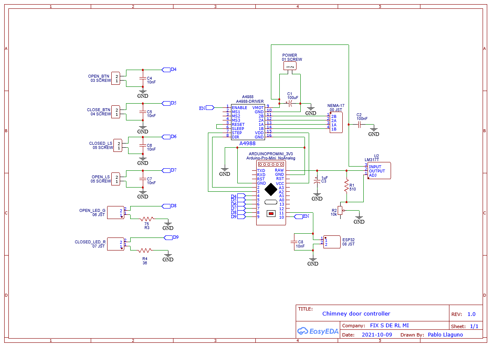
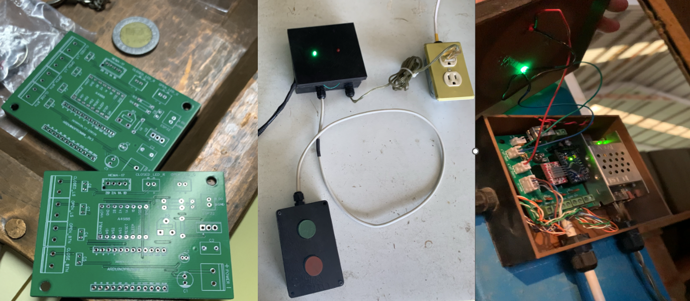

# 3D-Printed NEMA 17 Linear Actuator

A 3D-printed linear actuator project using a NEMA 17 stepper motor and a custom Arduino-based controller. This project was originally designed to automatically open and close the main chimney flue on a large industrial kiln. It is inspired by the robust and precise mechanics of 3D printers.

## 🌟 Features
* **Precise Control:** Uses a NEMA 17 stepper motor and A4988 driver for accurate positioning.
* **Custom PCB:** Includes a custom-designed PCB for a clean and reliable control circuit.
* **Robust Materials:** Designed with parts printed in Carbon Fiber PETG for strength and PLA for enclosures.
* **End-Stops:** Incorporates limit switches for homing and safe operation.
* **Expandable:** The controller includes a header for an ESP32, allowing for future Wi-Fi or IoT integration.

## 🛠️ Bill of Materials (BOM)

### Electronics
| Part                  | Quantity | Notes                                    |
| --------------------- | :------: | ---------------------------------------- |
| NEMA 17 Stepper Motor |    1     | Model: 17HS4401S           |
| Arduino Pro Mini      |    1     |3.3V version              |
| A4988 Stepper Driver  |    1     | Remember to set Vref! (See instructions) |
| Limit Switches        |    2     | For open/closed end-stops  |
| Push Buttons          |    2     | Normally Open (for manual control)       |
| Custom Controller PCB |    1     | Gerber/EasyEDA files are in `/hardware`  |
| *See PCB BOM for all board components* |   -    | Resistors, capacitors, headers, etc.     |

### Mechanical
| Part                  | Quantity | Notes                                    |
| --------------------- | :------: | ---------------------------------------- |
| 3/8" Threaded Rod     |    1     | The main lead screw |
| 5/16" Stainless Steel Rods |    2     | Smooth guide rods |
| Rigid Coupler         |    1     | Connects motor to threaded rod  |
| Linear Bearings       |    2+    | To slide on the smooth rods              |
| *Various Screws, Nuts, and Fasteners* |   -    | See the SolidWorks assembly file         |

### 3D Printed Parts
| Part                  | Material | Notes                                    |
| --------------------- | :------: | ---------------------------------------- |
| Actuator Body/Mounts  | Carbon Fiber | Files are in `/hardware/Mechanical/stl printing/` |
| Controller Enclosure  | PLA      | |

## 🔌 Wiring & Assembly

### Mechanical Assembly
The mechanical structure can be assembled by following the SolidWorks design files located in the `/hardware/Mechanical/solidworks/` directory. The main assembly file is `Ensamblaje2_v3.SLDASM`.

### Controller and Wiring
The electronics are centered around a custom PCB. Please refer to the schematic for detailed connections between the Arduino, A4988 driver, motor, limit switches, and buttons.

**Important:** It is highly recommended to use shielded cables (e.g., FTP) for all connections to the controller to prevent electromagnetic interference (EMI), especially in an industrial environment.

## ⚙️ A4988 Driver Setup (Crucial Step!)
Before operating the motor, you **must** set the maximum current limit on the A4988 driver to protect the motor. This is done by adjusting the reference voltage (`Vref`) on the small potentiometer on the driver board.

1.  **Calculate `Vref`**: The formula is `Vref = I_max * 8 * R_sense`.
    * The NEMA 17 17HS4401S motor has a max current (`I_max`) of 1.7A.
    * The sense resistors (`R_sense`) on the A4988 are typically 0.1Ω.
    * For safety, we will target a lower current of **1.0A**.
    * Therefore, `Vref = 1.0 * 8 * 0.1 = 0.8V`.

2.  **Adjust the Potentiometer**:
    * Connect the controller board to your power supply but **do not connect the motor**.
    * Set your multimeter to DC voltage mode.
    * Place the negative probe on a GND pin.
    * Place the positive probe on the metal top of the potentiometer.
    * Carefully turn the potentiometer until the multimeter reads your target `Vref` (e.g., 0.8V).

## 🚀 Code
The Arduino code is located in the `Chimenea_Botones_v2.ino` file. It uses the `AccelStepper` library for motor control.

The main `loop()` function continuously checks for input from the push buttons or an external signal (originally from an ESP32) and calls the appropriate functions to move the motor.

## 🙏 Acknowledgements
A special thank you to my friends **[Ricardo Rosas](https://github.com/RicardoRosasE) and [Gilberto Juarez](https://github.com/GJRangel)**, who were instrumental in the build - specially the mechanical design. This project would not have been possible without their help.

## ✅ To-Do List
- [x] Create initial detailed README
- [x] Upload Gerber files and a detailed BOM for the PCB
- [ ] Convert necessary solidwork parts to STL files
- [ ] Add hardware license

## 📄 License
This project uses a dual-license model:
* **Software:** All source code is licensed under the **MIT License**.
* **Hardware:** All hardware design files (CAD, STL, PCB) are licensed under the **_?_ license**.
